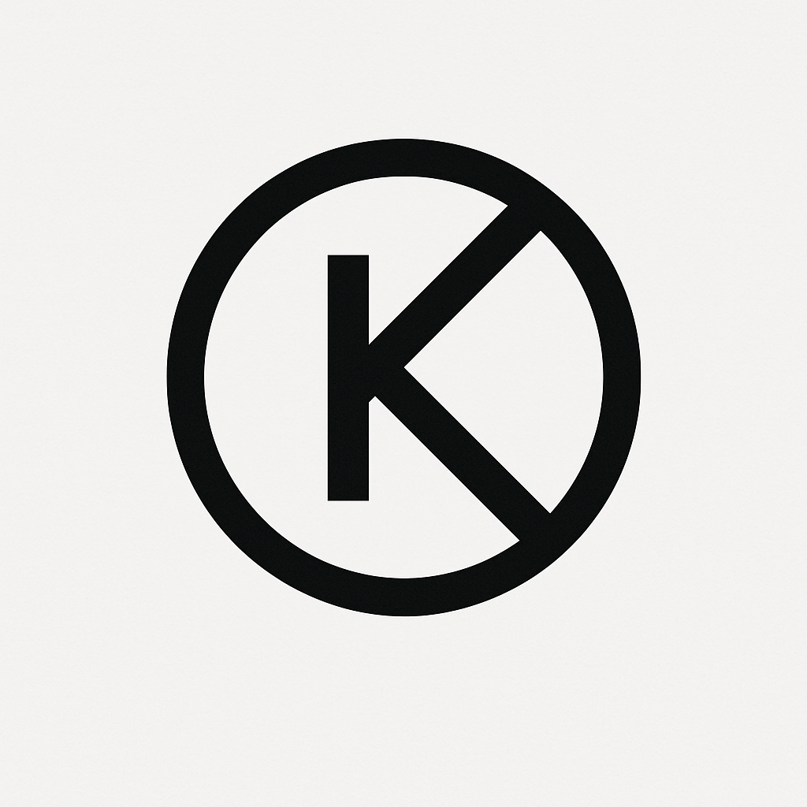
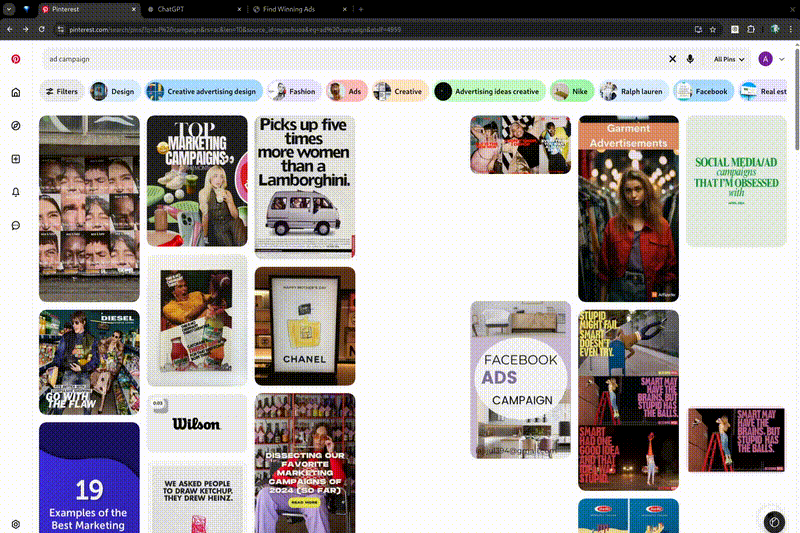

# PinGenerate AI

<div align="center">



</div>

## About PinGenerate AI

PinGenerate AI is a Chrome extension that provides a simple way to capture, store, and reuse images from the web. The extension allows you to copy images to your clipboard without downloading them, maintains a history of captured images, and provides keyboard shortcuts for quick access.

### Key Features

- **Image Capture**: Hover over any image and use Alt+Z to copy it to your clipboard
- **Image Gallery**: Toggle an image panel with Alt+A to view your recently captured images
- **Reusable Images**: Click on any thumbnail in the panel to copy it again
- **ChatGPT Integration**: Special support for direct image pasting into ChatGPT

## Demo

<div align="center">
  
</div>

_For the full demonstration video, [click here](pingenerateai.mp4)._

## Acknowledgments

This project was built using the [chrome-extension-boilerplate-react-vite](https://github.com/Jonghakseo/chrome-extension-boilerplate-react-vite) by [Jonghakseo](https://github.com/Jonghakseo). We would like to express our sincere gratitude to the creator and all contributors of this excellent boilerplate for making Chrome extension development significantly easier and more enjoyable.

## Table of Contents

- [Installation](#installation)
  - [Chrome Web Store](#chrome-web-store)
  - [Manual Installation](#manual-installation)
- [Usage](#usage)
  - [Keyboard Shortcuts](#keyboard-shortcuts)
- [Development](#development)
  - [Getting Started](#getting-started)
  - [Building the Extension](#building-the-extension)
- [FAQ](#faq)

## Installation

### Chrome Web Store

*Coming soon*

### Manual Installation

To install the extension manually (unpacked):

1. Download or clone this repository
2. Build the extension:
   ```
   pnpm install
   pnpm build
   ```
3. Open Chrome and navigate to `chrome://extensions/`
4. Enable "Developer mode" by toggling the switch in the top right corner
5. Click "Load unpacked" and select the `dist` directory from this project
6. The extension should now be installed and visible in your Chrome toolbar

## Usage

### Keyboard Shortcuts

#### Windows
- **Alt+Z**: Copy the image under your cursor to clipboard
- **Alt+A**: Toggle the image gallery panel
- **Ctrl+Shift+Y**: Open the extension popup

#### Linux
- **Alt+Z**: Copy the image under your cursor to clipboard
- **Alt+A**: Toggle the image gallery panel
- **Ctrl+Shift+Y**: Open the extension popup

#### Mac
- **Option(⌥)+Z**: Copy the image under your cursor to clipboard
- **Option(⌥)+A**: Toggle the image gallery panel
- **Command(⌘)+Shift+Y**: Open the extension popup

### Using the Image Gallery

1. **Open the gallery**: Use the appropriate keyboard shortcut for your operating system (Alt+A on Windows/Linux, Option+A on Mac)
2. **View recent captures**: The gallery shows your 5 most recently captured images as thumbnails
3. **Copy an image again**: Click on any thumbnail in the gallery to copy that image to your clipboard again
4. **Close the gallery**: Press the keyboard shortcut again, or click outside the gallery

### Using with ChatGPT

PinGenerate AI is specially designed to work seamlessly with ChatGPT:

1. Capture an image with the appropriate keyboard shortcut
2. Navigate to ChatGPT in your browser
3. Paste the image (Ctrl+V on Windows/Linux, Command+V on Mac)
4. The image will be attached to your message and ready to send

## Development

This extension is built using the chrome-extension-boilerplate-react-vite template, which uses React, TypeScript, and Vite.

### Getting Started

1. Clone this repository
2. Install pnpm globally: `npm install -g pnpm` (ensure your node version >= 22.12.0)
3. Install dependencies: `pnpm install`
4. Start the development server: `pnpm dev`
5. Load the extension in Chrome:
   - Navigate to `chrome://extensions/`
   - Enable "Developer mode"
   - Click "Load unpacked" and select the `dist` directory

### Building the Extension

- Development build: `pnpm dev`
- Production build: `pnpm build`
- Create a zip file: `pnpm zip`

## FAQ

**Q: Is PinGenerate AI free to use?**  
A: Yes, PinGenerate AI is completely free and open source.

**Q: Does the extension work offline?**  
A: The extension requires an internet connection to capture images from websites, but previously captured images can be accessed offline from the panel.

**Q: What happens to my captured images?**  
A: Images are stored locally in your browser's storage. They are not uploaded to any external servers.

**Q: Does it work with all types of images?**  
A: PinGenerate AI works with most standard web images, including JPG, PNG, GIF, SVG, and images with background styles.

**Q: How many images can I store?**  
A: The extension currently stores up to 20 recent images due to browser storage limitations.

**Q: Can I use this extension with Firefox?**  
A: While the primary focus is Chrome, you can build for Firefox by running:
```
pnpm dev:firefox
```
Then load it as a temporary add-on in Firefox.

---

## Original Boilerplate Information

This extension was built using [chrome-extension-boilerplate-react-vite](https://github.com/Jonghakseo/chrome-extension-boilerplate-react-vite).

### Installing dependencies

#### For root:
```
pnpm i <package> -w
```

#### For module:
```
pnpm i <package> -F <module name>
```

### Environment variables

Read: [Env Documentation](packages/env/README.md)

### Boilerplate structure

#### Chrome extension

The extension lives in the `chrome-extension` directory and includes the following files:

- [`manifest.ts`](chrome-extension/manifest.ts) - script that outputs the `manifest.json`
- [`src/background`](chrome-extension/src/background) - background script
- [`public`](chrome-extension/public/) - icons and styles

#### Pages

Code that is transpiled to be part of the extension lives in the [pages](pages/) directory:

- [`content`](pages/content/) - content scripts
- [`popup`](pages/popup/) - popup UI when clicking the extension icon
- Additional modules (content-ui, new-tab, options, side-panel, etc.)

## Troubleshooting

### Hot module reload seems to have frozen

If saving source files doesn't cause the extension HMR code to trigger a reload of the browser page, try this:

1. Ctrl+C the development server and restart it (`pnpm run dev`)
2. If you get a [`grpc` error](https://github.com/Jonghakseo/chrome-extension-boilerplate-react-vite/issues/612),
   [kill the
   `turbo` process](https://github.com/Jonghakseo/chrome-extension-boilerplate-react-vite/issues/612#issuecomment-2518982339)
   and run `pnpm dev` again.

## Community

To chat with other community members, you can join the [Discord](https://discord.gg/4ERQ6jgV9a) server.
You can ask questions on that server, and you can also help others.

Also, suggest new features or share any challenges you've faced while developing Chrome extensions!

## Reference

- [Chrome Extensions](https://developer.chrome.com/docs/extensions)
- [Vite Plugin](https://vitejs.dev/guide/api-plugin.html)
- [Rollup](https://rollupjs.org/guide/en/)
- [Turborepo](https://turbo.build/repo/docs)
- [Rollup-plugin-chrome-extension](https://www.extend-chrome.dev/rollup-plugin)
